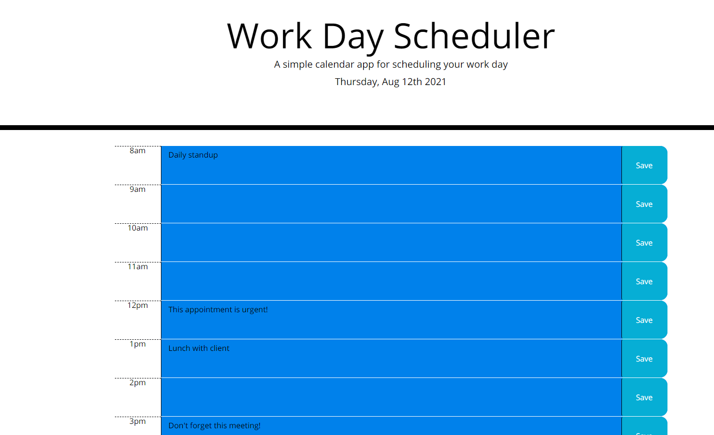

# Day Planner - Homework 5

### Description

For this project, I built a work day scheduler that saves tasks to local storage and uses Moment.js to track the current hour of the day. Hour blocks in the future are colored green, while hour blocks in the past are colored blue. The current hour is highlighted in red. 

When the user opens the application, today's date is displayed in the page header. The user is presented with 12 time blocks to enter tasks or appointments. When the user enters a task in the text-area and clicks the save button, their task is saved to localStorage.

### Screenshot of Deployed Application:

### Link to Deployed Application:

https://ericduwe.github.io/dayPlanner/